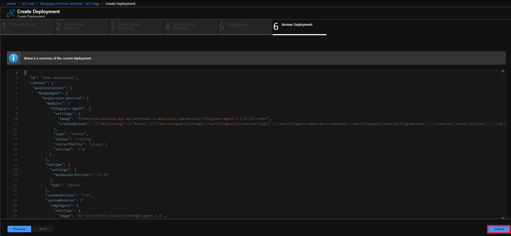
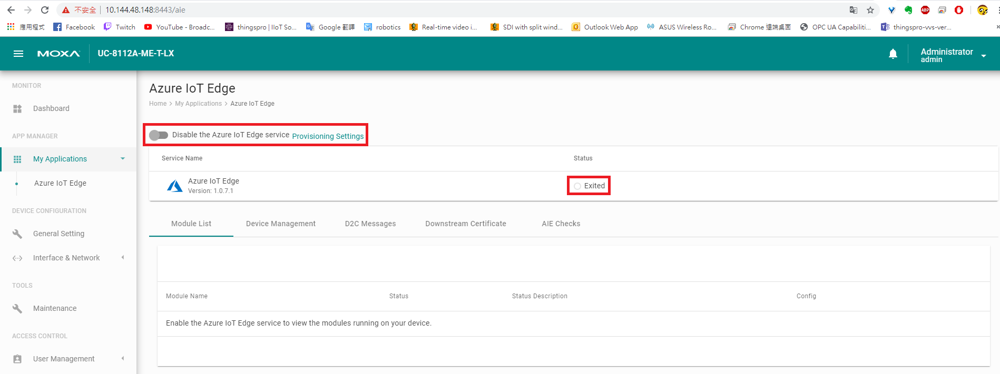

# Install ThingsPro Edge v1.1.0
## Set to Default

Remove docker folder
```sh
rm -rf /overlayfs/docker
```

Reset to default
```sh
mx-set-def
```

> Note: This will wipe out all the data on the device!

## Configure Network
```sh
dhclient eth0
```
> Note: Make sure there is a dhcp server on LAN1

## Download and Install ThingsPro
```sh
wget https://moxaics.s3-ap-northeast-1.amazonaws.com/v3/edge/builds/edge-core-update/release/iotedge/v1.1.0/400/update_1.1.0-400-uc-8112a-me_armhf.deb && \
dpkg -i ./update_1.1.0-400-uc-8112a-me_armhf.deb
```

## Track Installation Progress
```sh
journalctl -u update -f
```

## Reboot Device
```sh
reboot
```

# Configure Device - Part 1

## Make sure applications are ready before doing anything
```sh
watch appman app ls
```

## Setup Network (default: dhcp on eth0)
```sh
curl https://127.0.0.1:8443/api/v1/device/ethernets/1 \
    -X PATCH -H "Content-Type:application/json" \
    -H "mx-api-token:$(cat /var/thingspro/data/mx-api-token)" -k \
    -d '{"id":1,"type":"ethernets","enableDhcp":false,"ip":"10.144.48.148","netmask":"255.255.252.0","gateway":"10.144.51.254","dns":["10.128.8.8","10.128.8.5"]}' | json_pp
```

## Sync Time
```sh
docker exec -it device_app_1 sh -c "ntpdate pool.ntp.org"; hwclock -w;
```

## Enable SSH

By RESTful API
```
curl https://127.0.0.1:8443/api/v1/system/sshserver \
    -X PUT -H "Content-Type:application/json" \
    -H "mx-api-token:$(cat /var/thingspro/data/mx-api-token)" -k \
    -d '{"enable":true,"port":22}'
```

or by `appman` command
```
appman service set sshserver enable=true
```

# Setup IoT Edge
## Prepare IoT Edge Deployment


- Image URI:
    ```
    ff4n8xwrph.execute-api.ap-northeast-1.amazonaws.com/moxaics/thingspro-agent:1.1.0-159-armhf
    ```
- Container Create Options:
    ```
    {
      "HostConfig": {
        "Binds": [
          "/var/thingspro/iotedge/:/var/thingspro/cloud/setting/",
          "/var/thingspro/apps/device/moxaenv:/var/thingspro/cloud/setting/moxaenv",
          "/var/run/:/host/var/run/",
          "/var/thingspro/data/:/var/thingspro/data/"
        ],
        "LogConfig": {
          "Type": "json-file",
          "Config": {
            "max-size": "10m",
            "max-file": "10"
          }
        }
      }
    }
    ```


- Target Condition:
    ```
    tags.project='demo'
    ```


## Provision to IoT Edge
### Provision Tool


### Check AIE Application from GUI

> The sample provisioning utility creates the enrollment on DPS for each devices, generates the downstream certificate and enables IoT Edge service.

> We recommand users to create their own version of provisoning utility/service, since there should be more tasks to be finished during the provisioning process, such as changing default password.

# Configure Device - Part 2
## Modbus Setting

### Template
#### Get List
```sh
curl https://127.0.0.1:8443/api/v1/tags/fieldbus/modbus-tcp/templates \
    -X GET -H "Content-Type:application/json" \
    -H "mx-api-token:$(cat /var/thingspro/data/mx-api-token)" -k
```

#### Create
```sh
curl https://127.0.0.1:8443/api/v1/tags/fieldbus/modbus-tcp/templates \
    -X POST -H "Content-Type:application/json" \
    -H "mx-api-token:$(cat /var/thingspro/data/mx-api-token)" -k \
    -d '{"tagList":[{"address":0,"function":"read-coils","id":"ClearFlag","op":"read","pollingPeriodMs":10000,"quantity":1,"requestTimeoutMs":5000,"type":"boolean","unit":""},{"address":0,"function":"read-discrete-inputs","id":"EventFlag","op":"read","pollingPeriodMs":10000,"quantity":1,"requestTimeoutMs":5000,"type":"boolean","unit":""},{"address":0,"function":"read-holding-registers","id":"AI-mode","op":"read","pollingPeriodMs":10000,"quantity":2,"requestTimeoutMs":5000,"type":"float32","unit":""},{"address":0,"function":"read-input-registers","id":"DI-0","op":"read","pollingPeriodMs":10000,"quantity":4,"requestTimeoutMs":5000,"type":"float64","unit":""}],"templateName":"myNewTemplate"}'
```

#### Remove
```sh
curl https://127.0.0.1:8443/api/v1/tags/fieldbus/modbus-tcp/templates?name=myNewTemplate \
    -X DELETE -H "Content-Type:application/json" \
    -H "mx-api-token:$(cat /var/thingspro/data/mx-api-token)" -k
```

### Device
#### Get Device List
```sh
curl https://127.0.0.1:8443/api/v1/tags/fieldbus/modbus-tcp/devices \
    -X GET -H "Content-Type:application/json" \
    -H "mx-api-token:$(cat /var/thingspro/data/mx-api-token)" -k
```

#### Create
```sh
curl https://127.0.0.1:8443/api/v1/tags/fieldbus/modbus-tcp/devices \
    -X POST -H "Content-Type:application/json" \
    -H "mx-api-token:$(cat /var/thingspro/data/mx-api-token)" -k \
    -d '{"name":"myModbusSlave","templateName":"myNewTemplate","interface":"eth0","slaveId":1,"slaveIpAddress":"10.144.48.147","port":502}'
```

#### Remove
```sh
curl https://127.0.0.1:8443/api/v1/tags/fieldbus/modbus-tcp/devices?id={ID} \
    -X DELETE -H "Content-Type:application/json" \
    -H "mx-api-token:$(cat /var/thingspro/data/mx-api-token)" -k
```

### Restart Modbusmaster-tcp Application
```sh
curl https://127.0.0.1:8443/api/v1/apps/modbusmaster-tcp/restart \
    -X PUT -H "Content-Type:application/json" \
    -H "mx-api-token:$(cat /var/thingspro/data/mx-api-token)" -k
```

### Check Current Tag Data
- Query the latest tag values
    ```sh
    curl -H "mx-api-token: $(cat /var/thingspro/data/mx-api-token)" -k https://127.0.0.1:8443/api/v1/tags/monitor/myModbusSlave | json_pp
    ```
- Subscribe to tag changes
    ```sh
    docker exec -it tagservice_server_1 mxtagfsub
    ```

## Message Upload

### Get all tags
```sh
curl https://127.0.0.1:8443/api/v1/tags/all \
    -X GET -H "Content-Type:application/json" \
    -H "mx-api-token:$(cat /var/thingspro/data/mx-api-token)" -k
```

### Get Message Policy
```sh
curl https://127.0.0.1:8443/api/v1/azure-iotedge/messages \
    -X GET -H "Content-Type:application/json" \
    -H "mx-api-token:$(cat /var/thingspro/data/mx-api-token)" -k
```

### Set Message Policy
- Method Name: `message-policy-put`
- Payload:
    ```json
    {
        "groups": [
            {
                "enable": true,
                "outputTopic": "SystemTag",
                "properties": [
            {
                        "key": "Data Source",
                        "value": "IIoT Gateway"
                    },
            {
                        "key": "Payload Schema",
                        "value": "Moxa Default"
                    }
            ],
                "tags": [
                    {
                        "srcName": "system",
                        "tagNames": [
                            "cpuUsage",
                            "memoryUsage"
                        ]
                    }
                ],
                "pollingInterval": 0,
                "sendOutThreshold": {
                    "size": 4096,
                    "time": 10
                }
            },
            {
                "enable": true,
                "outputTopic": "ModbusTag",
                "properties": [],
                "tags": [
                    {
                        "srcName": "myModbusSlave",
                        "tagNames": [
                            "ClearFlag",
                            "EventFlag",
                            "AI-mode",
                            "DI-0"
                        ]
                    }
                ],
                "pollingInterval": 5,
                "sendOutThreshold": {
                    "size": 4096,
                    "time": 0
                }
            }
        ]
    }
    ```

### Remove Message Policy
```sh
curl https://127.0.0.1:8443/api/v1/azure-iotedge/messages/1 \
    -X DELETE -H "Content-Type:application/json" \
    -H "mx-api-token:$(cat /var/thingspro/data/mx-api-token)" -k
```
