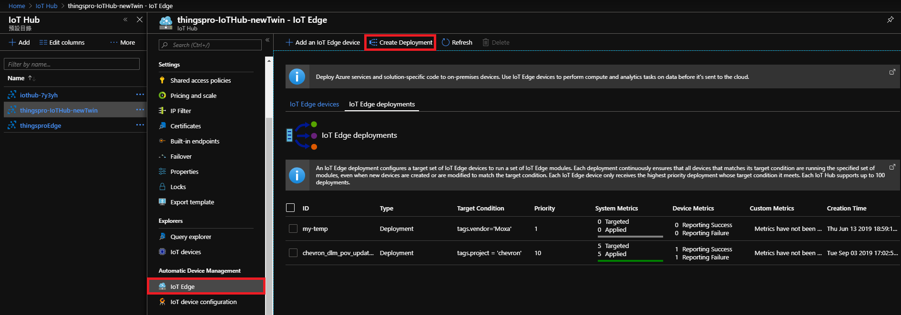
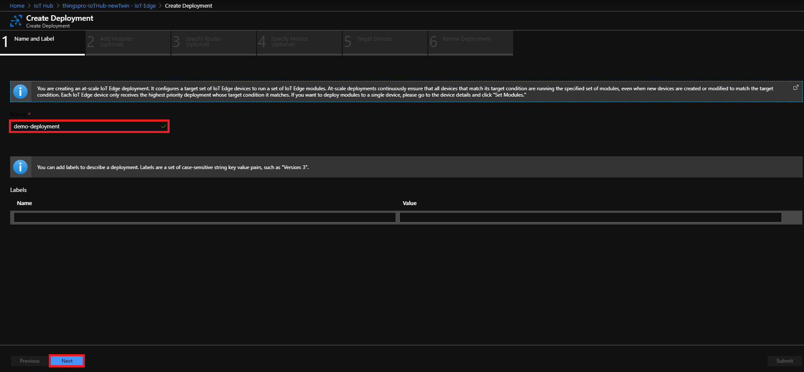
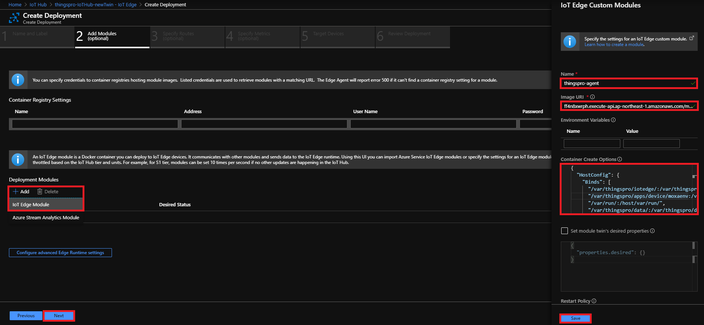
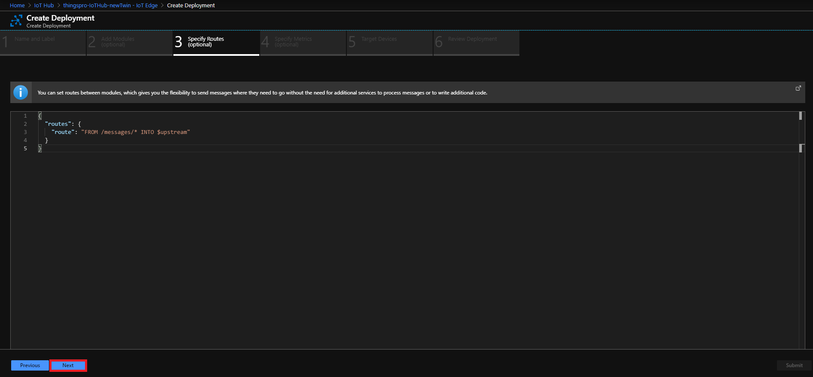
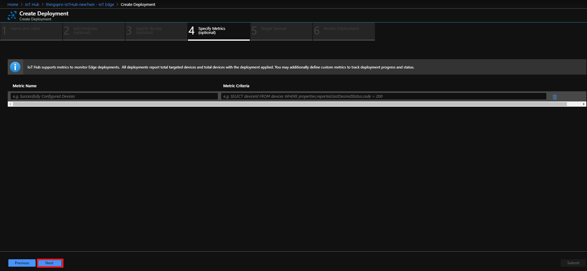
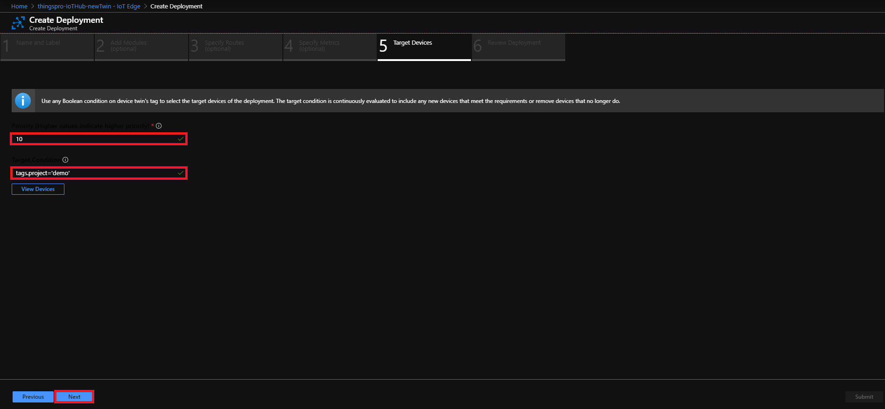
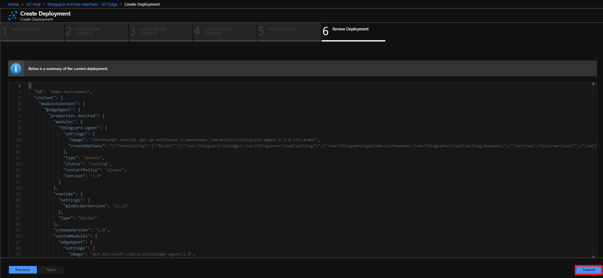
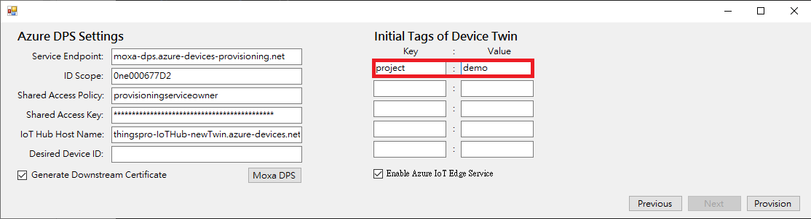
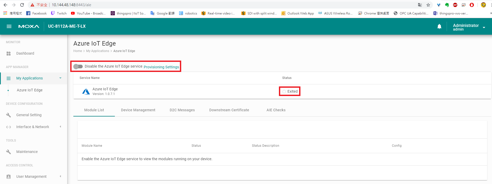

# Install ThingsPro Edge v1.1.0
## Set to Default
mx-set-def
rm -rf /overlayfs/docker

## Configure Network
dhclient eth0

## Download and Install ThingsPro
wget https://moxaics.s3-ap-northeast-1.amazonaws.com/v3/edge/builds/edge-core-update/release/iotedge/v1.1.0/400/update_1.1.0-400-uc-8112a-me_armhf.deb && \
dpkg -i ./update_1.1.0-400-uc-8112a-me_armhf.deb

## Track Installation Progress
journalctl -u update -f

## Reboot Device
reboot

# Configure Device - Part 1
## Make sure applications are ready before doing anything
watch appman app ls

## Setup Network (default: dhcp on eth0)
```
curl https://127.0.0.1:8443/api/v1/device/ethernets/1 \
    -X PATCH -H "Content-Type:application/json" \
    -H "mx-api-token:$(cat /var/thingspro/data/mx-api-token)" -k \
    -d '{"id":1,"type":"ethernets","enableDhcp":false,"ip":"10.144.48.148","netmask":"255.255.252.0","gateway":"10.144.51.254","dns":["10.128.8.8","10.128.8.5"]}' | json_pp
```

## Sync Time
```
docker exec -it device_app_1 sh -c "ntpdate tock.stdtime.gov.tw"; hwclock -w;
```

## Enable SSH
```
curl https://127.0.0.1:8443/api/v1/system/sshserver \
    -X PUT -H "Content-Type:application/json" \
    -H "mx-api-token:$(cat /var/thingspro/data/mx-api-token)" -k \
    -d '{"enable":true,"port":22}'
```
or
```
appman service set sshserver enable=true
```

# Setup IoT Edge
## Prepare IoT Edge Deployment



- Image URI:
```
ff4n8xwrph.execute-api.ap-northeast-1.amazonaws.com/moxaics/thingspro-agent:1.1.0-159-armhf
```
- Container Create Options:
```
{
  "HostConfig": {
    "Binds": [
      "/var/thingspro/iotedge/:/var/thingspro/cloud/setting/",
      "/var/thingspro/apps/device/moxaenv:/var/thingspro/cloud/setting/moxaenv",
      "/var/run/:/host/var/run/",
      "/var/thingspro/data/:/var/thingspro/data/"
    ],
    "LogConfig": {
      "Type": "json-file",
      "Config": {
        "max-size": "10m",
        "max-file": "10"
      }
    }
  }
}
```



- Target Condition:
```
tags.project='demo'
```


## Provision to IoT Edge
### Provision Tool


### Check AIE Application from GUI


# Configure Device - Part 2
## Modbus Setting

### Template
#### Get List
```
curl https://127.0.0.1:8443/api/v1/tags/fieldbus/modbus-tcp/templates \
    -X GET "Content-Type:application/json" \
    -H "mx-api-token:$(cat /var/thingspro/data/mx-api-token)" -k
```

#### Create
```
curl https://127.0.0.1:8443/api/v1/tags/fieldbus/modbus-tcp/templates \
    -X POST -H "Content-Type:application/json" \
    -H "mx-api-token:$(cat /var/thingspro/data/mx-api-token)" -k \
    -d '{"tagList":[{"address":0,"function":"read-discrete-inputs","id":"di0","op":"read","pollingPeriodMs":1000,"quantity":1,"requestTimeoutMs":5000,"type":"boolean","unit":"psi"},{"address":1,"function":"read-discrete-inputs","id":"di1","op":"read","pollingPeriodMs":1000,"quantity":1,"requestTimeoutMs":5000,"type":"boolean","unit":"psi"},{"address":2,"function":"read-discrete-inputs","id":"di2","op":"read","pollingPeriodMs":1000,"quantity":1,"requestTimeoutMs":5000,"type":"boolean","unit":"psi"},{"address":3,"function":"read-discrete-inputs","id":"di3","op":"read","pollingPeriodMs":1000,"quantity":1,"requestTimeoutMs":5000,"type":"boolean","unit":"psi"}],"templateName":"myNewTemplate"}'
```

#### Remove
```
curl https://127.0.0.1:8443/api/v1/tags/fieldbus/modbus-tcp/templates?name=myNewTemplate \
    -X DELETE -H "Content-Type:application/json" \
    -H "mx-api-token:$(cat /var/thingspro/data/mx-api-token)" -k
```

### Device
#### Get Device List
```
curl https://127.0.0.1:8443/api/v1/tags/fieldbus/modbus-tcp/devices \
    -X GET "Content-Type:application/json" \
    -H "mx-api-token:$(cat /var/thingspro/data/mx-api-token)" -k
```

#### Create
```
curl https://127.0.0.1:8443/api/v1/tags/fieldbus/modbus-tcp/devices \
    -X POST -H "Content-Type:application/json" \
    -H "mx-api-token:$(cat /var/thingspro/data/mx-api-token)" -k \
    -d '{"name":"ioLogik","templateName":"myNewTemplate","interface":"eth0","slaveId":1,"slaveIpAddress":"10.144.48.147","port":502}'
```

#### Remove
```
curl https://127.0.0.1:8443/api/v1/tags/fieldbus/modbus-tcp/devices?id={ID} \
    -X DELETE -H "Content-Type:application/json" \
    -H "mx-api-token:$(cat /var/thingspro/data/mx-api-token)" -k
```

### Restart Modbusmaster-tcp Application
```
curl https://127.0.0.1:8443/api/v1/apps/modbusmaster-tcp/restart \
    -X PUT -H "Content-Type:application/json" \
    -H "mx-api-token:$(cat /var/thingspro/data/mx-api-token)" -k
```

## Message Upload
### Get all tags
```
curl https://127.0.0.1:8443/api/v1/tags/all \
    -X GET -H "Content-Type:application/json" \
    -H "mx-api-token:$(cat /var/thingspro/data/mx-api-token)" -k
```

### Get Message Policy
```
curl https://127.0.0.1:8443/api/v1/azure-iotedge/messages \
    -X GET -H "Content-Type:application/json" \
    -H "mx-api-token:$(cat /var/thingspro/data/mx-api-token)" -k
```

### Set Message Policy
Message Name: `message-policy-put`
Payload:
```
{
    "groups": [
        {
            "enable": true,
            "outputTopic": "sample",
            "properties": [
        {
                    "key": "Data Source",
                    "value": "IIoT Gateway"
                },
        {
                    "key": "Payload Schema",
                    "value": "Moxa Default"
                }
        ],
            "tags": [
                {
                    "srcName": "system",
                    "tagNames": [
                        "cpuUsage",
                        "memoryUsage"
                    ]
                }
            ],
            "pollingInterval": 0,
            "sentOutThreshold": {
                "size": 4096,
                "time": 10
            }
        },
        {
            "enable": true,
            "outputTopic": "sample2",
            "properties": [],
            "tags": [
                {
                    "srcName": "ioLogik",
                    "tagNames": [
                        "di0",
                        "di1"
                    ]
                }
            ],
            "pollingInterval": 5,
            "sentOutThreshold": {
                "size": 4096,
                "time": 0
            }
        }
    ]
}
```

### Remove Message Policy
```
curl https://127.0.0.1:8443/api/v1/azure-iotedge/messages/1 \
    -X DELETE -H "Content-Type:application/json" \
    -H "mx-api-token:$(cat /var/thingspro/data/mx-api-token)" -k
```