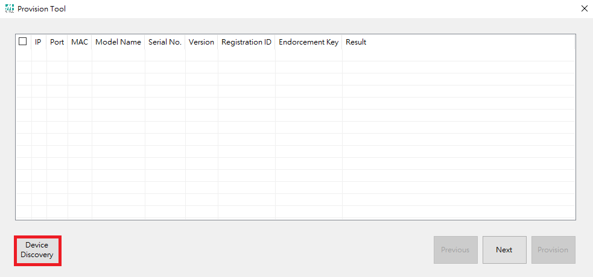
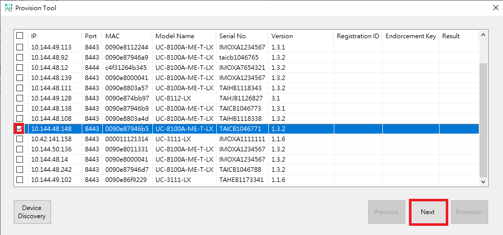
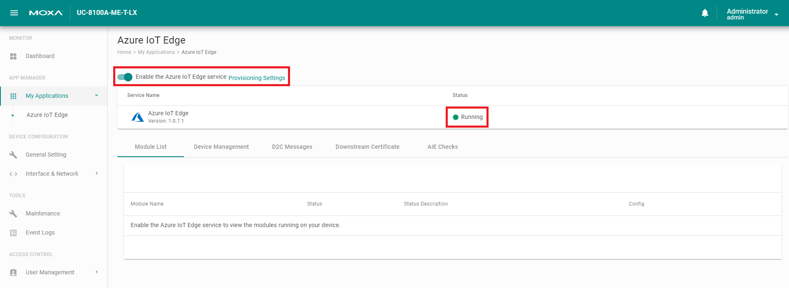

# Install ThingsPro Edge v1.1.0
## Set to Default

Reset to default

If the unit has been installed prior, we should reset it back to default before installing ThingsPro Edge.

```sh
mx-set-def
```

> Note: Make sure to have a console cable conected to the device.

Remove docker folder
```sh
rm -rf /overlayfs/docker /overlayfs/working/docker
```

> Note: This will wipe out all the data on the device!

## Configure Network
```sh
dhclient eth0
```
> Note: Make sure there is a dhcp server on LAN1

## Download and Install ThingsPro
- UC-8220:
    ```sh
    wget https://thingspro.blob.core.windows.net/software/edge/V2.0.0/update_2.0.0-1600-uc-8220-lx-iotedge_armhf.deb && \
    dpkg -i ./update_2.0.0-1600-uc-8220-lx-iotedge_armhf.deb
    ```
- UC-8112A:
    ```
    wget https://thingspro.blob.core.windows.net/software/edge/V2.0.0/update_2.0.0-1600-uc-8112a-me-iotedge_armhf.deb && \
    dpkg -i ./update_2.0.0-1600-uc-8112a-me-iotedge_armhf.deb
    ```

## Track Installation Progress
```sh
journalctl -u update -f
```

## Reboot Device
```sh
reboot
```

> Note: SSH will be disabled after installing ThingsPro Edge

> Note: Make sure to reboot only after the log shows **Stopped MOXA ThingsPro Updater.**

# Configure Device - Part 1

## Make sure applications are ready before doing anything
```sh
watch appman app ls
```

## Setup Network (default: dhcp on eth0)
```sh
curl https://127.0.0.1:8443/api/v1/device/ethernets/1 \
    -X PATCH -H "Content-Type:application/json" \
    -H "mx-api-token:$(cat /var/thingspro/data/mx-api-token)" -k \
    -d '{"id":1,"type":"ethernets","enableDhcp":false,"ip":"10.144.48.148","netmask":"255.255.252.0","gateway":"10.144.51.254","dns":["10.128.8.8","10.128.8.5"]}' | json_pp
```

## Sync Time
```sh
docker exec -it device_app_1 sh -c "ntpdate pool.ntp.org"; hwclock -w;
```

## Enable SSH

By RESTful API
```
curl https://127.0.0.1:8443/api/v1/system/sshserver \
    -X PUT -H "Content-Type:application/json" \
    -H "mx-api-token:$(cat /var/thingspro/data/mx-api-token)" -k \
    -d '{"enable":true,"port":22}'
```

or by `appman` command
```
appman service set sshserver enable=true
```

# Setup IoT Edge
## Prepare IoT Edge Deployment
- Create Deployment
        
- Name and Label

- Modules
    
    
    - Image URI:

        ```
        moxa2019/thingspro-agent:2.0.0-528-armhf
        ```

    
    - Container Create Options:
        ```
        {
            "HostConfig": {
                "Binds": [
                    "/var/thingspro/apps/cloud/data/setting/:/var/thingspro/cloudsetting/",
                    "/run/:/host/run/",
                    "/var/thingspro/data/:/var/thingspro/data/"
                ]
            }
        }
        ```
- Routes
    
    - NAME:
        ```
        route
        ```
    - VALUE:
        ```
        FROM /messages/* INTO $upstream
        ```
- Target Devices
    
    - Priority
        ```
        10
        ```
    - Target Condition:
        ```
        tags.project='demo'
        ```
- Review + create
    

## Provision to IoT Edge
### Provision Tool
- Modify Configuration File
    ```
    {
        "steps": [
            {
            "target": "Predefined",
            "description": "",
            "path": "",
            "method": "provision iot edge using dps",
            "post": {
                "scope": "{Service Endpoint of DPS}",
                "keyName": "{Shared Access Policy}",
                "key": "{Shared Access keys}",
                "scopeId": "{ID Scope of DPS}",
                "iotHubHostName": "{Target IoT Hub}",
                "initialTwin": {
                "properties": {},
                "tags": {
                    "{Key}": "{Value}"
                }
                },
                "generateDownstreamCertificate": true,
                "enableIoTEdge": true
            }
            }
        ]
    }
    ```
- Device Discovery


- Select Target Devices


- Provide Device Credential and Specify Provision Configuration


- Provision


- Check the Provision Result and Azure DPS


### Check AIE Application from GUI

> The sample provisioning utility creates the enrollment on DPS for each devices, generates the downstream certificate and enables IoT Edge service.

> We recommand users to create their own version of provisoning utility/service, since there should be more tasks to be finished during the provisioning process, such as changing default password.

# Configure Device - Part 2
## Modbus Setting
### Device
#### Get Device List
```sh
curl https://127.0.0.1:8443/api/v1/modbusmaster/config/remote-devs \
    -X GET -H "Content-Type:application/json" \
    -H "mx-api-token:$(cat /var/thingspro/data/mx-api-token)" -k | json_pp
```

#### Create Device(s)
```sh
curl https://127.0.0.1:8443/api/v1/modbusmaster/config/remote-devs \
    -X POST -H "Content-Type:application/json" \
    -H "mx-api-token:$(cat /var/thingspro/data/mx-api-token)" -k \
    -d '[{"masterTcpIfaceId":1,"name":"ioLogik-E1242","enable":1,"slaveIpaddr":"192.168.4.200","slaveTcpPort":502}]' | json_pp
```

#### Remove Device
`remoteDevId` can be obtained by **Get Device List**. This API returns `204 No Content` when succeeded.

```sh
curl https://127.0.0.1:8443/api/v1/modbusmaster/config/remote-devs/{remoteDevId} \
    -X DELETE -H "Content-Type:application/json" \
    -H "mx-api-token:$(cat /var/thingspro/data/mx-api-token)" -k
```
### Command
#### Get Command List
```
curl https://127.0.0.1:8443/api/v1/modbusmaster/config/mcmds \
    -X GET -H "Content-Type:application/json" \
    -H "mx-api-token:$(cat /var/thingspro/data/mx-api-token)" -k | json_pp
```

#### Create Command(s)
```sh
curl https://127.0.0.1:8443/api/v1/modbusmaster/config/mcmds?autoCreate=tags \
    -X POST -H "Content-Type:application/json" \
    -H "mx-api-token:$(cat /var/thingspro/data/mx-api-token)" -k \
    -d '[{"remoteDevId":1,"name":"AI_0_mode","mode":0,"func":3,"readAddress":544,"readQuantity":1,"pollInterval":10000,"swap":0,"dataType":"flaot"}]' | json_pp
```

### Apply Modbus Configuration
```sh
curl https://127.0.0.1:8443/api/v1/modbusmaster/control/config/apply \
    -X PUT -H "Content-Type:application/json" \
    -H "mx-api-token:$(cat /var/thingspro/data/mx-api-token)" -k \
    -d "{}" | json_pp
```

### Check Current Tag Data
- Query the latest tag values
    ```sh
    curl -H "mx-api-token: $(cat /var/thingspro/data/mx-api-token)" -k https://127.0.0.1:8443/api/v1/tags/monitor/myModbusSlave | json_pp
    ```
- Subscribe to tag changes
    ```sh
    docker exec -it tagservice_server_1 mxtagfsub
    ```

## Message Upload

### Get all tags
```sh
curl https://127.0.0.1:8443/api/v1/tags/all \
    -X GET -H "Content-Type:application/json" \
    -H "mx-api-token:$(cat /var/thingspro/data/mx-api-token)" -k | json_pp
```

### Get Message Policy
```sh
curl https://127.0.0.1:8443/api/v1/azure-iotedge/messages \
    -X GET -H "Content-Type:application/json" \
    -H "mx-api-token:$(cat /var/thingspro/data/mx-api-token)" -k | json_pp
```

### Set Message Policy
- Method Name: `message-policy-put`
- Payload:
    ```json
    {
        "groups": [
            {
                "enable": true,
                "outputTopic": "SystemTag",
                "properties": [
                    {
                        "key": "Data Source",
                        "value": "IIoT Gateway"
                    },
                    {
                        "key": "Payload Schema",
                        "value": "Moxa Default"
                    }
                ],
                "tags": [
                    {
                        "srcName": "system",
                        "tagNames": [
                            "cpuUsage",
                            "memoryUsage"
                        ]
                    }
                ],
                "pollingInterval": 0,
                "sendOutThreshold": {
                    "size": 4096,
                    "time": 10
                },
                "format": ""
            },
            {
                "enable": true,
                "outputTopic": "ModbusTag",
                "properties": [],
                "tags": [
                    {
                        "srcName": "E1242",
                        "tagNames": [
                            "AI_0_resetMaxValue",
                            "DI_0_counterOverflowFlag",
                            "AI_0_mode",
                            "AI_0_scaledValue"
                        ]
                    }
                ],
                "pollingInterval": 20,
                "sendOutThreshold": {
                    "size": 4096,
                    "time": 60
                },
                "format": "{iodb:[{(.tagName):(.dataValue),\"Time_\\(.tagName)\":(.ts/1000|todateiso8601)}],deviceId:(.srcName),time:(now|todateiso8601)}"
            }
        ]
    }
    ```

### Remove Message Policy
```sh
curl https://127.0.0.1:8443/api/v1/azure-iotedge/messages/1 \
    -X DELETE -H "Content-Type:application/json" \
    -H "mx-api-token:$(cat /var/thingspro/data/mx-api-token)" -k | json_pp
```
