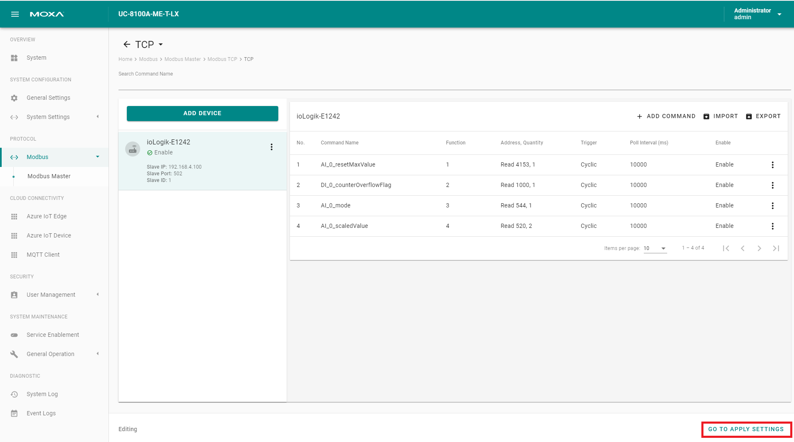

# 1. System Overview


# 2. Configure Device - Part 1

## 2.1 Make Sure Applications are Ready

```sh
watch appman app ls
```

Once all the applications are ready, connect our computer directly to LAN2 and change the computer's IP to 192.168.4.100, then we can login to the web GUI directly by https://192.168.4.127:8443. The default username/password is admin/admin@123.

## 2.2 Setup Network (default: dhcp on eth0)


## 2.3 Sync Time


## 2.4 Enable SSH


> The default username/password for SSH is moxa/moxa and default ip for LAN2 is 192.168.4.127.

# 3. Setup IoT Edge

## 3.1 Prepare IoT Edge Deployment

- Create Deployment

    

- Name and Label

    

- Modules

    - Create ThingsPro Edge Module

        
        

        - Image URI:

            ```
            moxa2019/thingspro-agent:2.1.1-929-armhf
            ```

    - Fix IoT Edge default modules' version (required) and protocol (optional):

        
        

        - Version: (Required)

            ```
            mcr.microsoft.com/azureiotedge-agent:1.0.9.4
            mcr.microsoft.com/azureiotedge-hub:1.0.9.4
            ```

        - Name: (Optional)

            ```
            UpstreamProtocol
            ```

        - Value: (Optional)

            ```
            MqttWs
            ```

    
    - Container Create Options:

        ```
        {
            "HostConfig": {
                "Binds": [
                    "/var/thingspro/apps/cloud/data/setting/:/var/thingspro/cloud/setting/",
                    "/run/:/host/run/",
                    "/var/thingspro/data/:/var/thingspro/data/"
                ]
            }
        }
        ```

    

- Routes

    

    - NAME:
        ```
        route
        ```

    - VALUE:
        ```
        FROM /messages/* INTO $upstream
        ```

- Target Devices

    

    - Priority
        ```
        10
        ```

    - Target Condition:
        ```
        tags.project='demo'
        ```

- Review + create

    

## 3.2 Provision to IoT Hub

### 3.2.1 Provision Tool

- Modify Configuration File
    ```
    {
        "steps": [
            {
            "target": "Predefined",
            "description": "",
            "path": "",
            "method": "provision iot edge using dps",
            "post": {
                "scope": "{Service Endpoint of DPS}",
                "keyName": "{Shared Access Policy}",
                "key": "{Shared Access keys}",
                "scopeId": "{ID Scope of DPS}",
                "iotHubHostName": "{Target IoT Hub}",
                "initialTwin": {
                "properties": {},
                "tags": {
                    "{Key}": "{Value}"
                }
                },
                "generateDownstreamCertificate": true,
                "enableIoTEdge": true
            }
            }
        ]
    }
    ```

- Device Discovery

    

- Select Target Devices

    

- Provide Device Credential and Specify Provision Configuration

    

- Provision

    

- Check the Provision Result and Azure DPS

    
    

### 3.2.2 Check AIE Application from GUI


> The sample provisioning utility creates the enrollment on DPS for each devices, generates the downstream certificate and enables IoT Edge service.

> We recommand users to create their own version of provisoning utility/service, since there should be more tasks to be finished during the provisioning process, such as changing default password.

# 4. Configure Device - Part 2

## 4.1 Modbus Setting

The modbus settings can be configured through ThingsPro Edge web GUI by clicking the **Modbus Master** tag from the side menu.


### 4.1.1 Add a Modbus TCP Device


- Basic Device Settings

    

- Add Commands (Tags) to the Device

    Here we are manually adding commands to the device, ThingsPro Edge also supports importing commands through a preconfigured csv file.

    
    
    
    
    
    

- Verify the Device and Command Settings


> The configurations won't take effect before we apply them. 

### 4.1.2 Apply Changes to Modbus Application


### 4.1.3 Check Current Tag Data

- Query the latest tag values

    ```sh
    curl "https://127.0.0.1:8443/api/v1/tags/monitor/modbus_tcp_master/ioLogik-E1242?tags=AI_0_resetMaxValue,DI_0_counterOverflowFlag,AI_0_mode,AI_0_scaledValue,status&streamInterval=1000" \
     -X GET -H "Content-Type:application/json" \
     -H "mx-api-token: $(cat /var/thingspro/data/mx-api-token)" -k
    ```

- Subscribe to tag changes

    ```sh
    docker exec -it tagservice_server_1 taghubd sub --all
    ```

## 4.2 Message Upload

### 4.2.1 Creating Message Group

After we've successfully configured the gateway to poll data from the ioLogik, now we send those data to Azure IoT Hub. To make it cost-effective, we are sending messages per minute. Having multiple message groups is supported by ThingsPro Edge.

- Create Message Group

    
    

- Setting Topic Name and Policies

    

- Select Commands (Tags)

    

- [Optional] Enable Custom Payload

    

- Submit

    

### 4.2.2 Monitor Uploaded Messages

Now the messages are being sent to IoT Hub. We can monitor the messages that are being sent by [**IoT Explorer**](https://github.com/Azure/azure-iot-explorer/releases).

- Provide IoT Hub Connection String

    

- Select the IoT Edge we are using

    

- Start Monitoring Telemetry Data

    

- Verify the Message Content

    
