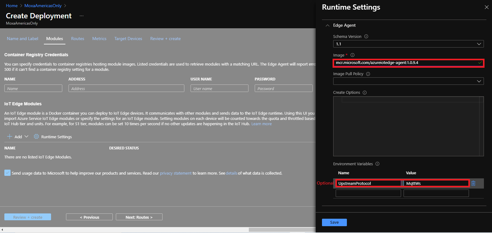
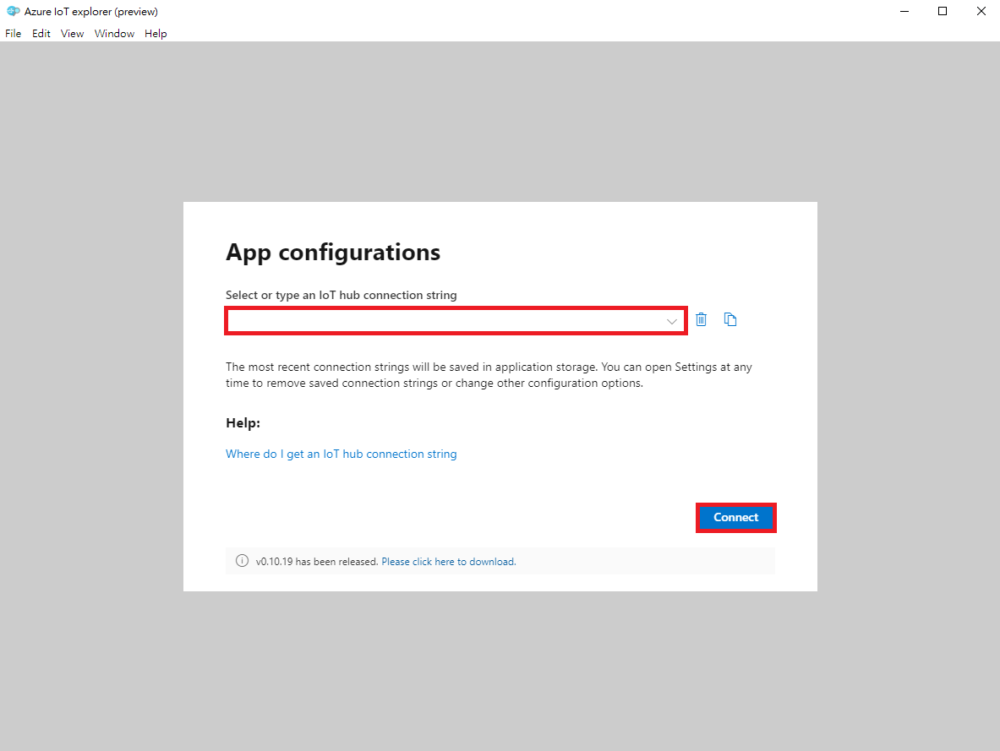

# Install ThingsPro Edge v2.0.0

## Check Bootloader Version

Please make sure the bootloader version is equal to or later than 1.1.2C11 (UC-8112A) and 2.2.0S02 (UC-8220).

```sh
fw_printenv | grep biosver
```

## Check Firmware Version

Please make sure the base image version is equal to or later than 1.3.2 (UC-8112A) or 1.2 (UC-8220).

```sh
kversion -a
```

## Set to Default

If the unit already has the correct version of bootloader and firmware, and also have been installed prior, we should reset it back to default before installing ThingsPro Edge. Otherwise, we can skip this step.

```sh
mx-set-def
```

> Note: Make sure to have a console cable conected to the device.

Remove docker folder
```sh
rm -rf /overlayfs/docker /overlayfs/working/docker
```

> Note: This will wipe out all the data on the device!

## Configure Network

```sh
dhclient eth0
```
> Note: Make sure there is a dhcp server on LAN1

## Download and Install ThingsPro

- UC-8220:

    ```sh
    wget https://thingspro.blob.core.windows.net/software/edge/V2.0.0/update_2.0.0-1600-uc-8220-lx-iotedge_armhf.deb && \
    dpkg -i ./update_2.0.0-1600-uc-8220-lx-iotedge_armhf.deb
    ```

- UC-8112A:

    > Make sure the bootloader version is 1.1.2C11 or later.

    ```sh
    wget https://thingspro.blob.core.windows.net/software/edge/V2.0.0/update_2.0.0-1600-uc-8112a-me-iotedge_armhf.deb && \
    dpkg -i ./update_2.0.0-1600-uc-8112a-me-iotedge_armhf.deb
    ```

## Track Installation Progress

```sh
journalctl -u update -f
```

## Reboot Device

```sh
reboot
```

> Note: SSH will be disabled after installing ThingsPro Edge

> Note: Make sure to reboot only after the log shows **Stopped MOXA ThingsPro Updater.**

# Configure Device - Part 1

## Make sure applications are ready before doing anything

```sh
watch appman app ls
```

Once all the applications are ready, connect our computer directly to LAN2 and change the computer's IP to 192.168.4.100, then we can login to the web GUI directly by https://192.168.4.127:8443. The default username/password is admin/admin@123.

## Setup Network (default: dhcp on eth0)


## Sync Time


## Enable SSH


# Setup IoT Edge

## Prepare IoT Edge Deployment

- Create Deployment

    

- Name and Label

    

- Modules

    - Create ThingsPro Edge Module

        
        

        - Image URI:

            ```
            moxa2019/thingspro-agent:2.0.0-528-armhf
            ```

    - Fix IoT Edge default modules' version and protocol:

        
        

        - Version:

            ```
            mcr.microsoft.com/azureiotedge-agent:1.0.9
            mcr.microsoft.com/azureiotedge-hub:1.0.9
            ```

        - Name:

            ```
            UpstreamProtocol
            ```

        - Value:

            ```
            MqttWs
            ```

    
    - Container Create Options:

        ```
        {
            "HostConfig": {
                "Binds": [
                    "/var/thingspro/apps/cloud/data/setting/:/var/thingspro/cloudsetting/",
                    "/run/:/host/run/",
                    "/var/thingspro/data/:/var/thingspro/data/"
                ]
            }
        }
        ```

    

- Routes

    

    - NAME:
        ```
        route
        ```

    - VALUE:
        ```
        FROM /messages/* INTO $upstream
        ```

- Target Devices

    

    - Priority
        ```
        10
        ```

    - Target Condition:
        ```
        tags.project='demo'
        ```

- Review + create

    

## Provision to IoT Hub

### Provision Tool

- Modify Configuration File
    ```
    {
        "steps": [
            {
            "target": "Predefined",
            "description": "",
            "path": "",
            "method": "provision iot edge using dps",
            "post": {
                "scope": "{Service Endpoint of DPS}",
                "keyName": "{Shared Access Policy}",
                "key": "{Shared Access keys}",
                "scopeId": "{ID Scope of DPS}",
                "iotHubHostName": "{Target IoT Hub}",
                "initialTwin": {
                "properties": {},
                "tags": {
                    "{Key}": "{Value}"
                }
                },
                "generateDownstreamCertificate": true,
                "enableIoTEdge": true
            }
            }
        ]
    }
    ```

- Device Discovery

    

- Select Target Devices

    

- Provide Device Credential and Specify Provision Configuration

    

- Provision

    

- Check the Provision Result and Azure DPS

    
    

### Check AIE Application from GUI


> The sample provisioning utility creates the enrollment on DPS for each devices, generates the downstream certificate and enables IoT Edge service.

> We recommand users to create their own version of provisoning utility/service, since there should be more tasks to be finished during the provisioning process, such as changing default password.

# Configure Device - Part 2

## Modbus Setting

The modbus settings can be configured through ThingsPro Edge web GUI by clicking the **Modbus Master** tag from the side menu.


### Add a Modbus TCP Device


- Basic Device Settings

    

- Add Commands (Tags) to the Device

    Here we are manually adding commands to the device, ThingsPro Edge also supports importing commands through a preconfigured csv file.

    
    
    
    
    
    

- Verify the Device and Command Settings


> The configurations won't take effect before we apply them. 

### Apply Changes to Modbus Application


### Check Current Tag Data

- Query the latest tag values

    ```sh
    curl "https://127.0.0.1:8443/api/v1/tags/monitor/modbus_tcp_master/ioLogik-E1242?tags=AI_0_resetMaxValue,DI_0_counterOverflowFlag,AI_0_mode,AI_0_scaledValue,status&streamInterval=1000" \
     -X GET -H "Content-Type:application/json" \
     -H "mx-api-token: $(cat /var/thingspro/data/mx-api-token)" -k
    ```

- Subscribe to tag changes

    ```sh
    docker exec -it tagservice_server_1 taghubd sub --all
    ```

## Message Upload

### Creating Message Group

After we've successfully configured the gateway to poll data from the ioLogik, now we send those data to Azure IoT Hub. To make it cost-effective, we are sending messages per minute. Having multiple message groups is supported by ThingsPro Edge.

- Create Message Group

    
    

- Setting Topic Name and Policies

    

- Select Commands (Tags)

    

- [Optional] Enable Custom Payload

    

- Submit

    

Now the messages are being sent to IoT Hub. We can monitor the messages that are being sent by [**IoT Explorer**](https://github.com/Azure/azure-iot-explorer/releases).

- Provide IoT Hub Connection String

    

- Select the IoT Edge we are using

    

- Start Monitoring Telemetry Data

    

- Verify the Message Content

    
