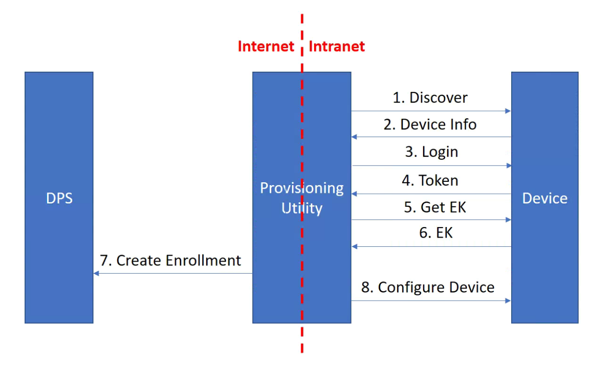

# Device Provision Flow

## 1. Factory [By Moxa]
### 1.1 Default Setting
Devices dfault enable UDP port 40404 for device discovery.

## 2. Provision [By SI or Client]


### 2.1 Discovery
The provisioning utility broadcasts to UDP port 40404 and wait for response from devices. Once device receives the broadcast, it should respond with it's informations, which will be used during the provisioning process, such as IP address, port and serial number.

### 2.2 Login
After discovering the devices, now the provisioning utility knows how to invoke API calls to each device. However, most of the ThingsPro APIs are protected by Json Web Tokens. The provisioning utility needs to login each device in order to get their token.

If this is the first time provisioning the device, the provisioning utility can login to the unit with default user name and password, otherwise user will have to provide the login credentials.

```
Optional:
- Username
- Password
```

### 2.3 Get Endorcement Key
The public endorcement key of the TPM can be obtained via API calls, while the private EK never leaves TPM. The public endorcement key will later be provided to DPS.

On the other hand, The storage root key is not provided by ThingsPro Edge API, as it changes once the user takes the ownership of TPM. and it's likely that ThingsPro Edge will not be able to know the latest SRK if users are taking ownership outside of ThingsPro.

> Note: The Device Provisioning Service does **not** check the SRK.

[Reference Link](https://docs.microsoft.com/en-us/azure/iot-dps/concepts-tpm-attestation#overview)

### 2.4 Create Enrollment
When trying to communicate with DPS, user will need to provide the DPS service enpoint to the provisioning utility. DPS APIs are also protected by access policies, user will also be asked to provide policy name and key as well.

Once the provisioning utility gets all the information it needs, it will generate a SAS token from DPS service enpoint, policy name and key. The SAS token is a required header field for DPS APIs.

```
Required:
- DPS service endpoint
- DPS policy name
- DPS policy key
```

### 2.5 Connection Information Writeback
The device needs to know the ID scope prior to connecting to the internet, the provisioning utility can help user configure the device if the ID scope is provided by user.

```
Required:
- DPS ID Scope
```

### 2.6 Configure Device
Other device configurations can also be applied in the device provision phase, for example, disabling unused services/ports.

## 3. Connect [By Device]

Once the device connects to DPS, DPS will generate a nonce, which is also *the key to connect to IoT Hub* in the future, then encrypt it with the EK public and send it back to the device.

Although sending key through internet doesn't sound secure, the key is actually encrypted and protected by public EK, as a result, only the device with the exact TPM will be able to decrypt and make use of the nonce.

After the TPM decrypts the nonce, *the nonce never leaves TPM*. The device will then sign a SAS token with the nonce, then use it to reconnect to DPS.

Once DPS verifies the nonce challange has been completed, it provisions the device to IoT Hub based on the allocation policy and responds with the IoT Hub connection information.

[Reference Link](https://docs.microsoft.com/en-us/azure/iot-dps/concepts-tpm-attestation)