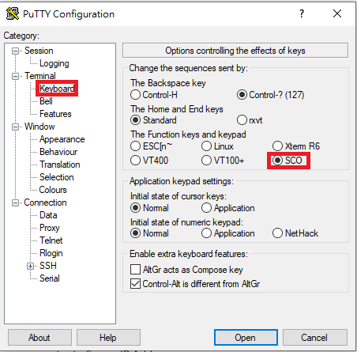
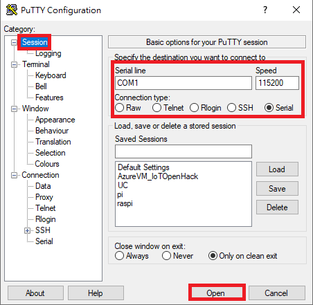
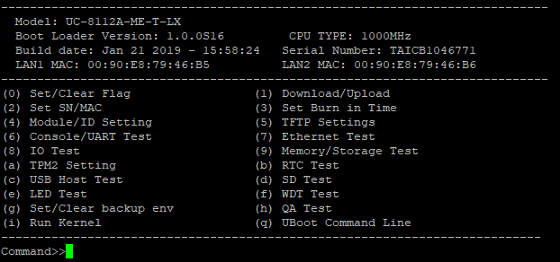
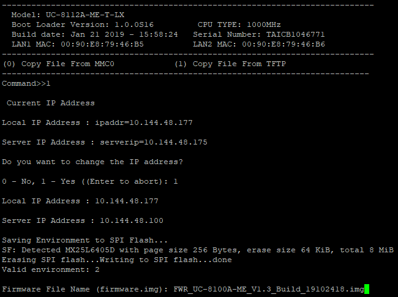

# Firmware Upgrade - UC-8112A-ME-T

UC-8112A-ME-T Series comes with a SD/SIM card holder in the front of the device, so we are upgrading the firmware through SD.

## Step-by-Step
1. Get the firmware v1.3.2 image from [here](https://moxa-my.sharepoint.com/:u:/p/franksh_li/Ebf6WJiIEoRJj1iu_NDvM18BRBNPQ8EXcUxyCXWnAWDr_g?e=ZBvO4I) and save it to a SD card.

2. Physically connect PC and UC-8112A-ME-T by Console Cable, also insert the SD card to the unit

3. (Putty) Configure the finction keys and keypad to SCO

    

4. (Putty) Open session

    

5. Get into the boot menu by rebooting the UC-8112A-ME-T and long press `*` before it enters OS.

    

6. Upload/Download (Press 1 and enter)

7. Firmware (Press 1 and enter)

8. Copy File From MMC0 (Press 0 and enter)

9. Firmware File Name: <THE FILE NAME IN SD CARD WITH EXTENSION>
    > It should be `FWR_UC-8100A-ME_1.3.2_SystemBuild_20032511_ImageBuild_200325_120432.img` if we havn't modify the file name.

    
